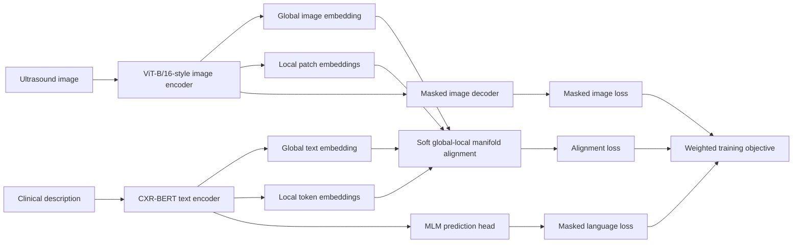

# ALTA: Ultrasound Vision-Language Pretraining and Zero-Shot Evaluation

ALTA is a research-oriented vision-language framework for ultrasound image understanding. This repository contains the source code used to train the competition model, perform prompt-based zero-shot evaluation on multiple ultrasound classification tasks, and generate qualitative visualizations for model analysis.

The implementation combines a Vision Transformer image encoder, a CXR-BERT text encoder, masked image and language modeling objectives, and a soft global-local manifold alignment module. The alignment module jointly models image-level and text-level semantics while establishing fine-grained correspondences between image patches and text tokens.

This README documents the code as it exists in this source release. Dataset files, pretrained encoders, and trained checkpoints are not included and must be supplied separately.

## Contents

- [Highlights](#highlights)
- [Method Overview](#method-overview)
- [Repository Structure](#repository-structure)
- [Requirements](#requirements)
- [Pretrained Assets](#pretrained-assets)
- [Data Preparation](#data-preparation)
- [Pretraining](#pretraining)
- [Zero-Shot Evaluation](#zero-shot-evaluation)
- [Visualization](#visualization)
- [Outputs and Checkpoints](#outputs-and-checkpoints)
- [Reproducibility Notes](#reproducibility-notes)
- [Implementation Notes](#implementation-notes)
- [Acknowledgements](#acknowledgements)

## Highlights

- **Ultrasound vision-language pretraining.** The model learns from paired ultrasound images and free-text descriptions stored in JSONL format.
- **Global and local cross-modal alignment.** A learnable gate combines global image-text alignment with bidirectional patch-token matching.
- **Three complementary objectives.** Training optimizes manifold alignment, masked language modeling (MLM), and masked image modeling (MIM).
- **Parameter-efficient adaptation.** When a masked image reconstruction checkpoint is provided, most of the visual backbone is frozen while adapters, normalization layers, projection layers, and the final Transformer blocks remain trainable.
- **Multiple zero-shot tasks.** Standalone scripts cover BUSI breast lesions, HCC versus hemangioma, thyroid benign-versus-malignant classification, and three-class lymph-node classification.
- **Interpretability utilities.** The code can visualize patch-token similarity, patch importance, fusion-gate behavior, feature distributions, and qualitative heatmaps.
- **Training utilities.** The entry point supports mixed precision, gradient accumulation, distributed training, checkpoint resume, TensorBoard logging, best-checkpoint selection, learning-rate reduction, and early stopping.

## Method Overview

### Architecture

The default model is implemented by `ALTA_ViT` in `model.py`.



The default visual encoder uses 224 x 224 RGB inputs, 16 x 16 patches, a 768-dimensional embedding, 12 Transformer blocks, and 12 attention heads. Global and local image features are projected into a shared embedding space whose default dimension is 512.

The text branch extends a Hugging Face BERT checkpoint through `CXRBertModel`. It exposes both a projected `[CLS]` representation and token-level hidden states. The last two BERT encoder layers and the projection head are trainable; the remaining BERT parameters are frozen.

### Soft Global-Local Manifold Alignment

`SoftGlobalLocalManifoldAlignment` receives four normalized feature sets:

- global image features;
- local image-patch features;
- global text features; and
- local text-token features.

The module computes a patch-token similarity tensor, derives soft patch and token importance weights, and performs bidirectional patch-to-token and token-to-patch matching. A learnable gate, denoted by `beta` in the implementation, fuses global representations with locally pooled representations.

The alignment objective contains:

1. a bidirectional global InfoNCE term;
2. a weighted local cosine-alignment term;
3. an entropy regularizer that controls the effective support of patch and token weights;
4. a variance-floor regularizer intended to reduce representation collapse;
5. a gate-entropy regularizer; and
6. an optional topology-preservation term based on KL divergence between visual and matched-text affinity distributions.

### Pretraining Objectives

The complete objective is

```text
L_total = w_align * L_align + w_mlm * L_mlm + w_mim * L_mim
```

The default weights are `w_align = 1.0`, `w_mlm = 0.2`, and `w_mim = 1.0`.

- **Alignment loss (`L_align`)** aligns global and local vision-language representations.
- **Masked language modeling (`L_mlm`)** masks approximately 15% of eligible text tokens and predicts the original vocabulary IDs.
- **Masked image modeling (`L_mim`)** reconstructs masked image patches with a Transformer decoder. The default image masking ratio is 0.75.

For runs longer than 50 epochs, `engine_pretrain.py` changes the relative MLM and MIM weights after epoch 50 and again after epoch 60. Review that schedule before comparing runs with different training durations.

### Parameter Adaptation

When `--mae_path` points to an existing masked image reconstruction checkpoint, the image encoder is initialized from that checkpoint and most visual parameters are frozen. The implementation keeps the following components trainable:

- adapter and projection-head parameters;
- the final three visual Transformer blocks;
- normalization and domain-normalization layers; and
- LayerScale parameters when present.

If the MRM checkpoint is not found, the model prints a warning and does not apply this checkpoint-dependent freezing procedure.

## Repository Structure

```text
src/
|-- main_pretrain.py                # Main pretraining entry point
|-- model.py                        # ALTA model and image/text feature interfaces
|-- engine_pretrain.py              # Epoch loop, optimization, logging, and diagnostics
|-- pretrain_datasets.py            # Pretraining JSONL dataset and BUSI dataset
|-- manifold_alignment_simple.py    # Soft global-local manifold alignment
|-- cxrbert.py                      # CXR-BERT wrapper, projection head, and MLM head
|-- vision_decoder.py               # Transformer decoder for masked image modeling
|-- masking_utils.py                # Patch masking, patchify, and unpatchify helpers
|-- loss_functions.py               # MLM and experimental auxiliary losses
|-- adapter_block.py                # Active ViT block with adapters
|-- adapter_block_ALTA.py           # Alternative adapter-block implementation
|-- adapter_block_new.py            # Experimental adapter-block implementation
|-- adapter_block_no_atten.py       # Attention-adapter ablation
|-- adapter_block_no_FFN.py         # Feed-forward adapter ablation
|-- busi_eval_utils.py              # BUSI evaluation called during pretraining
|-- zero-shot-busi.py               # Single-checkpoint BUSI evaluation
|-- zero-shot-busi_1.py             # Single- or multi-checkpoint BUSI evaluation
|-- zero-shot-hcc.py                # HCC versus hemangioma evaluation
|-- zero-shot-thyroid.py            # Thyroid benign/malignant evaluation
|-- zero-shot-lymph-node.py         # Three-class lymph-node evaluation
|-- visualization_utils.py          # Training-time and sample-level visualizations
|-- run_visualization.py            # Standalone figure-generation workflow
`-- util/
    |-- misc.py                     # Distributed setup, metrics, AMP, and checkpoints
    |-- lr_sched.py                 # Warm-up and cosine learning-rate schedule
    |-- lr_decay.py                 # Layer-wise learning-rate decay utilities
    |-- pos_embed.py                # Sinusoidal positional embeddings
    `-- trainable_params.py         # Parameter-freezing helpers
```

`model.py` imports `Block` from `adapter_block.py`. The other `adapter_block_*.py` files are retained as experimental or ablation variants; the `--adapter_type` argument does not automatically switch between these files.

## Requirements

### Runtime

The source does not include a pinned environment file. A recent Python 3 environment with a CUDA-capable PyTorch installation is recommended. The pretraining loop uses CUDA automatic mixed precision and calls `torch.cuda.synchronize()`, so the current training implementation should be treated as CUDA-dependent.

The main Python dependencies are:

- PyTorch;
- torchvision;
- timm;
- Hugging Face Transformers;
- NumPy;
- pandas;
- Pillow;
- scikit-learn;
- Matplotlib; and
- TensorBoard.

### Example Environment Setup

Install PyTorch and torchvision using the command appropriate for the local CUDA version, then install the remaining packages:

```bash
python -m venv .venv
source .venv/bin/activate

python -m pip install --upgrade pip
# Install torch and torchvision for the required CUDA runtime first.
python -m pip install timm transformers numpy pandas pillow scikit-learn matplotlib tensorboard
```

On Windows PowerShell, activate the environment with:

```powershell
.\.venv\Scripts\Activate.ps1
```

Because dependency versions are not pinned in this source release, record the resolved environment for any official reproduction run:

```bash
python -m pip freeze > environment.lock.txt
```

## Pretrained Assets

Two external model assets are expected.

### 1. CXR-BERT or Compatible BERT Directory

`--bert_path` must point to a local Hugging Face-compatible directory that can be loaded by both `BertTokenizer.from_pretrained()` and `CXRBertModel.from_pretrained()`.

A typical directory contains files such as:

```text
Bio_ClinicalBERT/
|-- config.json
|-- pytorch_model.bin or model.safetensors
|-- tokenizer_config.json
|-- vocab.txt
`-- special_tokens_map.json
```

The exact files depend on how the checkpoint was exported.

### 2. Masked Image Reconstruction Checkpoint

`--mae_path` points to the visual-pretraining checkpoint used to initialize the image encoder. The loader accepts a raw state dictionary or a dictionary containing `model` or `state_dict`.

The checkpoint is loaded with `strict=False`. Always review the reported missing and unexpected keys, especially when reproducing a competition submission.

## Data Preparation

All images are converted to RGB and normalized with ImageNet statistics. The default spatial resolution is 224 x 224.

### Pretraining Data

The pretraining dataset expects a root directory containing a fixed JSONL filename and one or more image subdirectories:

```text
pretrain_data/
|-- us_caption_train_qwen3_8b.jsonl
|-- us_caption_val_qwen3_8b.jsonl       # Supported by the dataset class; not used by main_pretrain.py
|-- images/
|   |-- case_0001.png
|   `-- ...
|-- images2/
|   `-- ...
`-- images3/
    `-- ...
```

Each JSONL line must contain an `image` field and a non-empty `refined` or `caption` field. When both text fields are present, `refined` takes precedence.

```json
{"image": "case_0001.png", "refined": "Ultrasound demonstrates a well-circumscribed hypoechoic lesion."}
{"image": "case_0002.png", "caption": "A heterogeneous lesion with irregular margins."}
```

The image value is interpreted as a filename relative to each directory listed through `--image_dirs`. Entries whose images cannot be found are skipped during dataset initialization.

The current text preprocessing lowercases each caption, replaces non-alphanumeric characters with spaces, collapses repeated spaces, and pads or truncates the result to 128 tokens.

### BUSI Evaluation Data

BUSI evaluation expects an image directory, a two-column CSV label file, and a text file that lists test image IDs:

```text
busi/
|-- images/
|   |-- image_001.png
|   `-- ...
|-- labels.csv
`-- test.txt
```

Example `labels.csv`:

```csv
image,label
image_001.png,0
image_002.png,1
```

Example `test.txt`:

```text
image_001.png
image_002.png
```

The prompt order used by the BUSI scripts is benign (`0`) followed by malignant (`1`).

### HCC versus Hemangioma Data

`zero-shot-hcc.py` expects class folders with exact names:

```text
hcc_test/
|-- Hemangioma/      # label 0
|   `-- ...
`-- HCC/             # label 1
    `-- ...
```

Supported extensions are PNG, JPEG, BMP, TIFF, and WebP.

### Thyroid Data

`zero-shot-thyroid.py` expects numeric class directories:

```text
thyroid_test/
|-- 0/               # benign
|   `-- ...
`-- 1/               # malignant
    `-- ...
```

The script contains eight alternative prompt sets selected with `--prompt_set 1` through `--prompt_set 8`.

### Lymph-Node Data

`zero-shot-lymph-node.py` uses an image directory and a CSV file with the required columns `file_name`, `fold_number`, and `category`:

```csv
file_name,fold_number,category
sample_001.png,0,0
sample_002.png,1,2
```

The class mapping is:

| Category | Prompt class |
|---:|---|
| 0 | Metastatic lymph node |
| 1 | Lymphoma |
| 2 | Benign lymph node |

Rows whose `fold_number` equals `--val_fold` are used for evaluation.

## Pretraining

Run commands from the directory containing `main_pretrain.py` so that local imports resolve correctly.

### Important: Configure Training-Time BUSI Evaluation

`main_pretrain.py` calls `evaluate_zero_shot_busi()` after every `--eval_freq` epochs. In the current source, `busi_eval_utils.py` contains fixed BUSI paths rather than reading them from the training command line.

Before starting pretraining, set the three dataset paths inside `evaluate_zero_shot_busi()` to the local BUSI image directory, label CSV, and split file. Otherwise, training will fail when the first scheduled evaluation begins. The standalone `zero-shot-busi.py` script does expose these paths as command-line arguments.

### Single-GPU Example

```bash
python main_pretrain.py \
  --data_path /path/to/pretrain_data \
  --image_dirs images images2 images3 \
  --bert_path /path/to/Bio_ClinicalBERT \
  --mae_path /path/to/MRM.pth \
  --output_dir /path/to/outputs/alta \
  --log_dir /path/to/outputs/alta/tensorboard \
  --batch_size 64 \
  --epochs 50 \
  --mask_ratio 0.75 \
  --eval_freq 1 \
  --save_freq 5 \
  --keep_only_best \
  --device cuda
```

`--batch_size` is the per-process batch size. When `--lr` is omitted, the effective learning rate is calculated from the base learning rate:

```text
effective_batch_size = batch_size * accum_iter * world_size
learning_rate = blr * effective_batch_size / 256
```

### Distributed Example

```bash
torchrun --standalone --nproc_per_node=4 main_pretrain.py \
  --data_path /path/to/pretrain_data \
  --image_dirs images images2 images3 \
  --bert_path /path/to/Bio_ClinicalBERT \
  --mae_path /path/to/MRM.pth \
  --output_dir /path/to/outputs/alta-ddp \
  --log_dir /path/to/outputs/alta-ddp/tensorboard \
  --batch_size 32 \
  --accum_iter 2 \
  --epochs 50 \
  --device cuda
```

### Resume Training

```bash
python main_pretrain.py \
  --resume /path/to/outputs/alta/checkpoint-best_combined.pth \
  --data_path /path/to/pretrain_data \
  --image_dirs images images2 images3 \
  --bert_path /path/to/Bio_ClinicalBERT \
  --mae_path /path/to/MRM.pth \
  --output_dir /path/to/outputs/alta \
  --log_dir /path/to/outputs/alta/tensorboard
```

By default, resume restores model, optimizer, scaler, and epoch state when those fields are present. Add `--from_begin` to load model weights without restoring the optimizer or advancing the start epoch.

### Principal Training Arguments

| Argument | Default | Description |
|---|---:|---|
| `--batch_size` | `128` | Per-process batch size |
| `--epochs` | `50` | Maximum training epochs |
| `--accum_iter` | `1` | Gradient-accumulation steps |
| `--proj_dim` | `512` | Shared vision-language projection size |
| `--blr` | `1.5e-4` | Base learning rate used for batch-size scaling |
| `--weight_decay` | `0.05` | AdamW weight decay |
| `--warmup_epochs` | `40` | Linear warm-up duration before cosine decay |
| `--mask_ratio` | `0.75` | Image-patch masking ratio |
| `--w_align` | `1.0` | Alignment-loss multiplier |
| `--w_mlm` | `0.2` | MLM-loss multiplier |
| `--w_mim` | `1.0` | MIM-loss multiplier |
| `--align_topo_w` | `0.20` | Topology regularization weight |
| `--eval_freq` | `1` | BUSI evaluation interval in epochs |
| `--save_freq` | `5` | Periodic checkpoint interval in epochs |
| `--patience` | `15` | Early-stopping patience |
| `--lr_patience` | `5` | Evaluations without improvement before LR reduction |
| `--lr_factor` | `0.5` | Multiplicative LR reduction factor |
| `--num_workers` | `10` | Training DataLoader workers |

Use `python main_pretrain.py --help` for the complete argument list.

### TensorBoard

```bash
tensorboard --logdir /path/to/outputs/alta/tensorboard
```

The training loop logs the three component losses, total loss, learning rate, and zero-shot BUSI metrics.

## Zero-Shot Evaluation

The evaluation scripts use fixed medical prompts defined in each source file. Binary tasks compute accuracy, precision, recall, F1 score, and ROC AUC. The lymph-node script reports macro-averaged multiclass metrics and one-versus-rest macro AUC.

Model hyperparameters must match the checkpoint being evaluated. State dictionaries are loaded non-strictly to accommodate DDP prefixes and minor checkpoint-format differences; review all reported missing and unexpected keys.

### BUSI: Single Checkpoint

```bash
python zero-shot-busi.py \
  --checkpoint /path/to/checkpoint-best_combined.pth \
  --bert_path /path/to/Bio_ClinicalBERT \
  --mae_path /path/to/MRM.pth \
  --image_root /path/to/busi/images \
  --label_csv /path/to/busi/labels.csv \
  --split_txt /path/to/busi/test.txt \
  --output_dir /path/to/evaluation/busi \
  --eval_batch_size 16 \
  --device cuda
```

### BUSI: Checkpoint Sweep

`zero-shot-busi_1.py` evaluates either one checkpoint or an indexed range of checkpoint files.

```bash
python zero-shot-busi_1.py \
  --checkpoint_dir /path/to/checkpoints \
  --checkpoint_prefix checkpoint- \
  --checkpoint_suffix .pth \
  --start_idx 0 \
  --end_idx 10 \
  --bert_path /path/to/Bio_ClinicalBERT \
  --mae_path /path/to/MRM.pth \
  --image_root /path/to/busi/images \
  --label_csv /path/to/busi/labels.csv \
  --split_txt /path/to/busi/test.txt \
  --output_dir /path/to/evaluation/busi-sweep
```

Pass `--checkpoint /path/to/model.pth` to use its single-checkpoint mode instead.

### HCC versus Hemangioma

```bash
python zero-shot-hcc.py \
  --checkpoint /path/to/checkpoint-best_combined.pth \
  --bert_path /path/to/Bio_ClinicalBERT \
  --mae_path /path/to/MRM.pth \
  --test_dir /path/to/hcc_test \
  --output_dir /path/to/evaluation/hcc \
  --eval_batch_size 16 \
  --device cuda
```

### Thyroid Benign versus Malignant

```bash
python zero-shot-thyroid.py \
  --checkpoint /path/to/checkpoint-best_combined.pth \
  --bert_path /path/to/Bio_ClinicalBERT \
  --mae_path /path/to/MRM.pth \
  --test_dir /path/to/thyroid_test \
  --prompt_set 3 \
  --output_dir /path/to/evaluation/thyroid \
  --eval_batch_size 16 \
  --device cuda
```

### Lymph-Node Classification

```bash
python zero-shot-lymph-node.py \
  --ckpt /path/to/checkpoint-best_combined.pth \
  --bert_path /path/to/Bio_ClinicalBERT \
  --mae_path /path/to/MRM.pth \
  --csv_path /path/to/5fold_cross_validation.csv \
  --image_root /path/to/lymph_node/images \
  --val_fold 0 \
  --batch_size 16 \
  --device cuda
```

The standalone evaluation scripts select CPU when CUDA is unavailable, although CPU inference can be substantially slower.

## Visualization

### Training-Time Visualizations

`engine_pretrain.py` writes alignment diagnostics under the configured output directory. It collects patch similarity and importance statistics during training and periodically calls `ALTAVisualizer` for qualitative analysis.

Typical directories include:

```text
output_dir/
|-- alignment_visualizations/
|-- visualizations/
`-- attention_maps/
```

### Standalone Figure Generation

`run_visualization.py` currently supports the HCC-versus-hemangioma folder dataset:

```bash
python run_visualization.py \
  --checkpoint /path/to/checkpoint-best_combined.pth \
  --bert_path /path/to/Bio_ClinicalBERT \
  --data_root /path/to/hcc_test \
  --dataset hcc \
  --save_dir /path/to/paper_figures \
  --max_samples 500 \
  --baseline_checkpoint /path/to/baseline_checkpoint.pth \
  --device cuda
```

The script can generate:

- t-SNE comparisons (`figA_tsne`);
- patch-token similarity figures (`figB_patch_token`);
- ultrasound heatmap overlays (`figC_overlay_*`);
- fusion-gate distributions (`figD_beta`);
- score-distribution comparisons (`figE_score_dist`); and
- an ablation radar chart (`figF_ablation_radar`).

**Publication-use warning:** if `--baseline_checkpoint` is missing or invalid, the script creates synthetic perturbed baseline features or scores for the t-SNE and score-distribution demonstrations. The radar-chart values in `plot_fig_F()` are also manually defined in the source. Replace these demonstration values with measured experiment outputs before using the figures in a report, competition submission, or publication.

## Outputs and Checkpoints

The pretraining entry point can produce the following files:

| Output | Purpose |
|---|---|
| `checkpoint-best_auc.pth` | Best checkpoint selected by BUSI AUC |
| `checkpoint-best_acc.pth` | Best checkpoint selected by BUSI accuracy |
| `checkpoint-best_combined.pth` | Best checkpoint selected by `accuracy + AUC` |
| `checkpoint-<epoch>.pth` | Periodic checkpoint when `--keep_only_best` is not enabled |
| `log.txt` | One JSON record per completed epoch |
| `training_summary.json` | Best metrics, best epoch, elapsed time, and early-stop status |
| `busi_eval_history_local.csv` | BUSI evaluation history with manifold alignment |
| `busi_eval_history_wo_align.csv` | BUSI evaluation history for global cosine ablation |
| TensorBoard event files | Loss, learning-rate, and evaluation traces |

Checkpoint dictionaries saved by `util/misc.py` contain the model state, optimizer state, epoch, scaler state, run arguments, and a checkpoint name.

The HCC and thyroid standalone scripts also append metrics to a file named `busi_eval_history_local.csv` in their respective output directories. The filename is retained for compatibility and does not indicate that those evaluations use the BUSI dataset.

## Reproducibility Notes

For an official competition reproduction, record all of the following:

1. the exact Python and dependency versions;
2. the CUDA, cuDNN, and GPU configuration;
3. the CXR-BERT and MRM checkpoint identities or hashes;
4. the training JSONL and image-set versions;
5. the BUSI evaluation split used for checkpoint selection;
6. the complete command line and effective batch size;
7. the random seed and number of DataLoader workers; and
8. the final checkpoint hash.

The default seed is 42 and is offset by the distributed rank during pretraining. However, `cudnn.benchmark` is enabled in the training entry point, random image augmentation is active, and DataLoader workers are used. The default configuration therefore does not guarantee bitwise-deterministic results across machines.

For debugging or closer repeatability, consider using a fixed software stack, a single GPU, and `--num_workers 0`. Any change to deterministic backend settings should be documented because it may alter runtime and numerical behavior.

## Implementation Notes

- **Absolute path defaults:** several command-line defaults reference the original development environment. Override all path arguments explicitly.
- **Integrated BUSI evaluation:** the BUSI paths in `busi_eval_utils.py` are fixed in source and are not controlled by `main_pretrain.py` arguments.
- **CUDA pretraining:** the current epoch loop uses CUDA AMP and CUDA synchronization directly. The evaluation scripts are more tolerant of CPU execution.
- **Adapter variants:** only `adapter_block.py` is imported by `model.py`. Selecting another adapter file requires changing the import or implementing an explicit factory.
- **Checkpoint compatibility:** loaders generally use `strict=False`. This is convenient for DDP checkpoints but can also conceal architecture mismatches unless the reported keys are inspected.
- **Dataset validation:** pretraining entries with missing images are skipped; malformed JSON lines and entries without usable text are ignored.
- **Evaluation prompts:** predictions depend on the prompt text and prompt order defined in each evaluation script. Prompt changes constitute a different evaluation configuration and should be reported.
- **Visualization fallbacks:** standalone comparison figures may use demonstration data when a real baseline is unavailable; see the warning in the visualization section.

## Acknowledgements

This implementation uses PyTorch, timm Vision Transformer components, Hugging Face Transformers, and CXR-BERT-style text modeling. It also incorporates common masked autoencoder utilities for patch masking, positional embeddings, reconstruction, optimization, and distributed training.

Please respect the licenses and terms of all external datasets, pretrained checkpoints, and upstream libraries used with this code.

